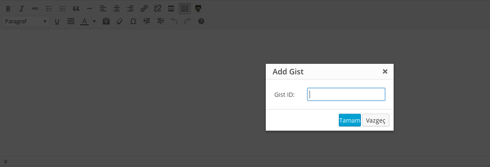
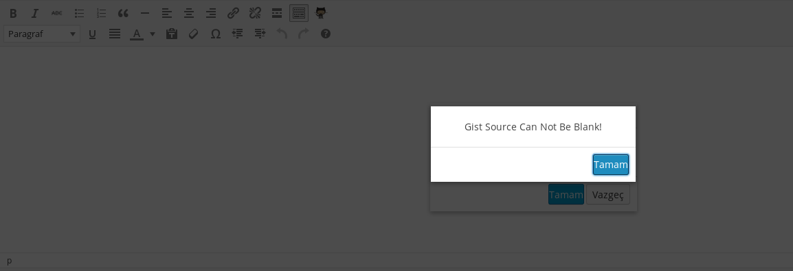
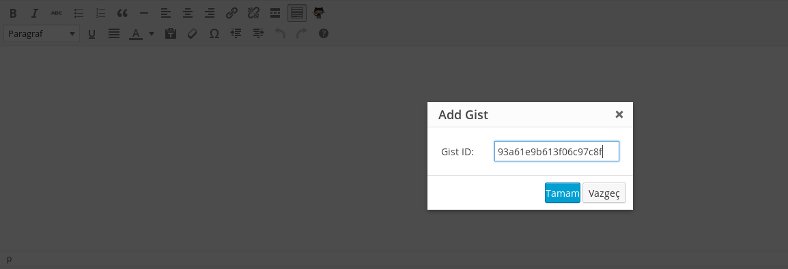
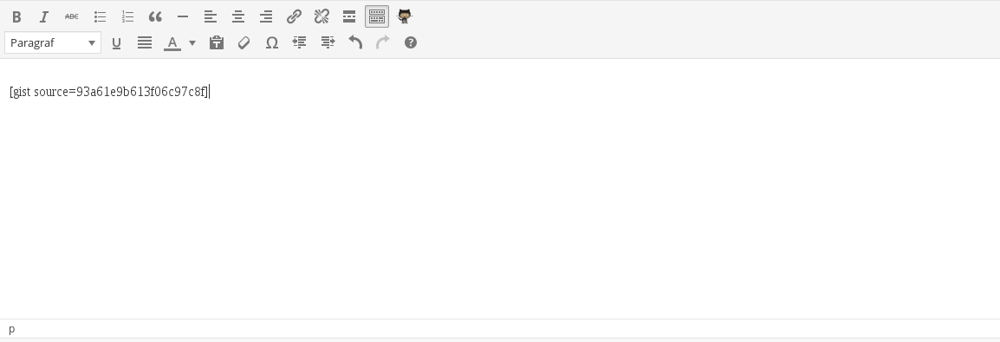
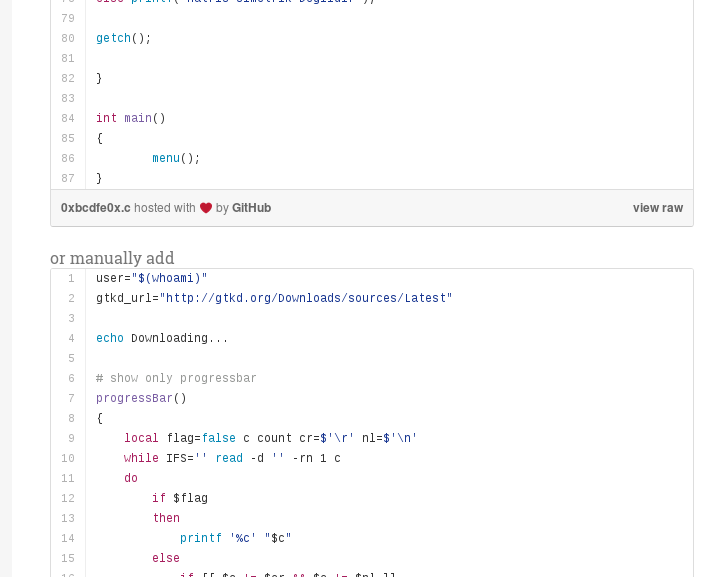

#Gist Viewer

İndirme: [ZIP Dosyası](https://github.com/aligoren/wp-gist-viewer/archive/master.zip)

Kodlar: [wp-gist-viewer](wp-gist-viewer) dizininde

Gist üzerindeki kodları çeker. Örneğin;

[https://gist.github.com/aligoren/93a61e9b613f06c97c8f](https://gist.github.com/aligoren/93a61e9b613f06c97c8f)

Buradaki kodları çeker. Yaptığı ekleme ise

```html
<script src="https://gist.github.com/aligoren/93a61e9b613f06c97c8f.js"></script>
```

şeklinde oluyor. İki şekilde ekleme var. El ile ekleme ya da Github Octocat butonu ile ekleme.

```code
[gist source=93a61e9b613f06c97c8f]
```

##Bazı görseller

**Octocat Butonu**



-------------------------

Metin alanı boş bırakıldığında hata mesaj üretir.



-------------------------

Metin alanına da sadece `93a61e9b613f06c97c8f` gibi ID eklemek yeterli.



-------------------------

Eklendiği zaman böyle bir görüntü oluşuyor.



-------------------------

Yazı sayfasında ise görüntü şöyle oluyor.


